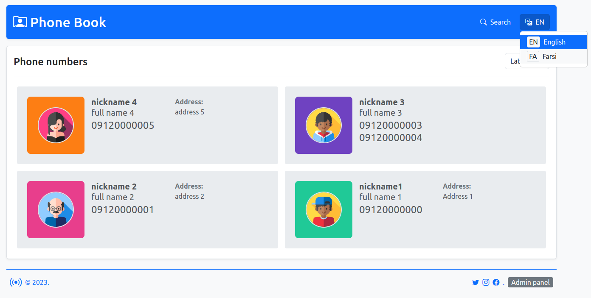
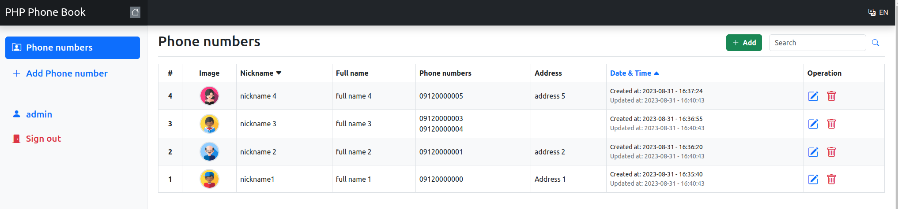

# PHP Phone Book
[فارسی](https://awaweb.ir/blog/posts/php-phone-book) | English

[](https://awaweb.ir/projects/free/php_phone_book)
[](https://awaweb.ir/projects/free/php_phone_book/admin2023)

___
### Demo 
> UTC Timezone
+ [Admin panel demo](https://awaweb.ir/projects/free/php_phone_book/admin2023) &#8628;
     > **username:** admin<br> 
     > **password:** 123  
+ [Front page demo](https://awaweb.ir/projects/free/php_phone_book)

### Setup
1. Create a new MySQL database.
2. Set your **database information** and your `PROJECT_URL` in `config.php`.

3 & 4:

> 3. Browse `/setup` to create the required tables and admin sign up.
>     > Ex. `https://localhost/PHP-Phone-Book/setup/`
> 4. Remove `/setup` directory.
> #### OR
> 3. Remove `/setup` directory.
> 4. IMPORT php_phone_book.sql to your database table.
>    > The username added after import is: admin , password: 123

5. Set `media` directory permission to 777.
   > $ sudo chmod -R 777 media

+ Browse your project url. `Ex. https://localhost/PHP-Phone-Book/ | Admin panel: https://localhost/PHP-Phone-Book/admin2023`
___

### Requirement
- Apache HTTP web server.
- MySQL database
- PHP ^8.2.4
- Apache module *mod-rewrite* must be enabled. [&#8628;](#enable-the-apache-module-mod_rewrite)
- mysqli, mysqlnd, pdo ,pdo_mysql PHP extensions must be enabled.
> To check the above: `<?php phpinfo(); ?>` - [PHPInfo](https://www.php.net/manual/en/function.phpinfo.php)
- allowOverride must be set to All (for your root directory) in the Apache configuration file. [&#8628;](#set-config-allowoverride-all)

___
### Information
+ HTTP server: [Apache](https://httpd.apache.org/) 
+ Programming language: [PHP](https://www.php.net/) 8.2.4
+ Programming paradigm: [OOP](https://en.wikipedia.org/wiki/Object-oriented_programming)
+ Architectural patterns: [MVC](https://en.wikipedia.org/wiki/Model%E2%80%93view%E2%80%93controller)
+ Template engine: [TWIG](https://twig.symfony.com/) 3.0
+ Database: [MySQL](https://www.mysql.com/)
* Licensed under [MIT](https://github.com/ramoures/PHP-Phone-Book/blob/main/LICENSE)

#### I used:
+ URL Routing methods.
+ [TWIG](https://twig.symfony.com/) template engine.
+  *[PDO](https://www.php.net/manual/en/book.pdo.php) & [Prepared Statements](https://www.php.net/manual/en/mysqli.quickstart.prepared-statements.php)* MySQL Connection.
+ [Singleton](https://en.wikipedia.org/wiki/Singleton_pattern) [**design patterns**](https://en.wikipedia.org/wiki/Design_Patterns) for some required classes.
+ Multi language support.
+ Many *options* for configuration. *`config.php`*
+ Sorting and pagination of items.
+ Client and server side **captcha** for sign in form.
   >  Optional config: *Google reCaptcha* or *Cloudflare Turnstile*
+ Errors handling method.
+ [Bootstrap](https://getbootstrap.com/) and [jQuery](https://jquery.com/).
___
### HELP
#### Add new language
1. Create your language file in the `lang` folder.
>Ex. *fr.php* or *ar.php* and develop similar to `lang/fa.php`.
2. Add your new language for frontend pages.<br>
```
<!-- Example: -->
<div class="changeLanguage">
     <button id="fr">Fr</button>
     <button id="en">En</button>
</div>
<!-- Look at: .changeLanguage click function on view/assets/js/app.js or backend.js  -->

```
______
#### Solutions

##### Enable the apache module *mod_rewrite*
  
`$ sudo a2enmod rewrite`

##### Set config allowoverride All

Edit the Apache config file:

`$ cd /etc/apache2`

`$ sudo nano apache2.conf`

Find:
```
<Directory /var/www/>
        Options Indexes FollowSymLinks
        AllowOverride None
        Require all granted
</Directory>
```
And change it to:
```
<Directory /var/www/>
        Options Indexes FollowSymLinks
        AllowOverride All
        Require all granted
</Directory>
```
> `/var/www/` : your root directory.
> 
Press Ctrl + o (for save), then Ctrl + x (for exit).

Then,

`$ sudo systemctl restart apache2`

[Apache mod_rewrite module](https://httpd.apache.org/docs/current/mod/mod_rewrite.html)

____

Linkedin: [ramoures](https://www.linkedin.com/in/ramoures/)<br>
E-mail: ramoures@gmail.com
